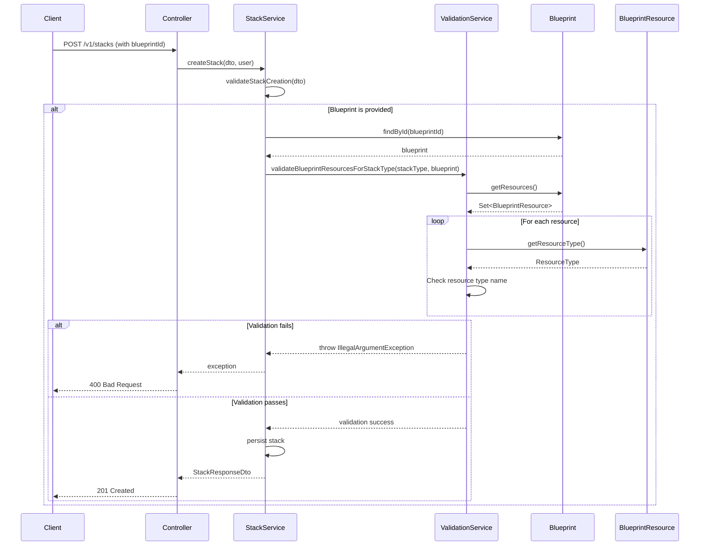
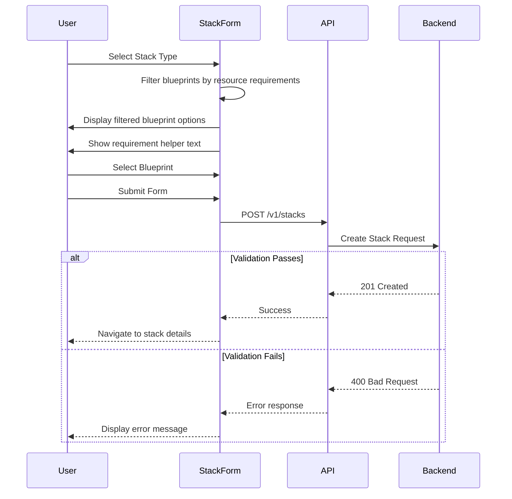

# Design Document: Stack-Blueprint Resource Validation

## Overview

This feature implements validation logic to ensure that stacks are associated with appropriate blueprint resources based on their stack type. The validation enforces that container-based stacks (RESTful API, Event-driven API) must have a Container Orchestrator in their blueprint, and JavaScript Web Applications must have an S3 bucket (Storage resource) in their blueprint. This prevents misconfiguration and ensures stacks have the necessary infrastructure for deployment.

The validation will be implemented as a domain service that is invoked during stack creation and update operations, before any database persistence occurs.

## Architecture

### Component Overview

```
┌─────────────────────────────────────────────────────────────┐
│                    Presentation Layer                        │
│                  (StacksController)                          │
└────────────────────────┬────────────────────────────────────┘
                         │
                         ▼
┌─────────────────────────────────────────────────────────────┐
│                   Application Layer                          │
│                    (StackService)                            │
│  - createStack()                                             │
│  - updateStack()                                             │
└────────────────────────┬────────────────────────────────────┘
                         │
                         ▼
┌─────────────────────────────────────────────────────────────┐
│                     Domain Layer                             │
│         (BlueprintResourceValidationService)                 │
│  - validateBlueprintResourcesForStackType()                  │
│  - hasContainerOrchestrator()                                │
│  - hasStorageResource()                                      │
└────────────────────────┬────────────────────────────────────┘
                         │
                         ▼
┌─────────────────────────────────────────────────────────────┐
│                   Domain Entities                            │
│  - Blueprint (with resources collection)                     │
│  - BlueprintResource (with resourceType)                     │
│  - ResourceType (with name field)                            │
└─────────────────────────────────────────────────────────────┘
```

### Validation Flow



## Components and Interfaces

### 1. BlueprintResourceValidationService (New)

**Location**: `idp-api/src/main/java/com/angryss/idp/domain/services/BlueprintResourceValidationService.java`

**Purpose**: Domain service responsible for validating that a blueprint contains the required resources for a given stack type.

**Interface**:
```java
@ApplicationScoped
public class BlueprintResourceValidationService {
    
    /**
     * Validates that the blueprint contains required resources for the stack type.
     * 
     * @param stackType The type of stack being created
     * @param blueprint The blueprint to validate (can be null for Infrastructure-only stacks)
     * @throws IllegalArgumentException if validation fails
     */
    public void validateBlueprintResourcesForStackType(StackType stackType, Blueprint blueprint);
    
    /**
     * Validates that the selected blueprint resource is valid for the stack type and belongs to the blueprint.
     * 
     * @param stackType The type of stack being created
     * @param blueprint The blueprint being used
     * @param blueprintResourceId The ID of the selected blueprint resource (can be null)
     * @throws IllegalArgumentException if validation fails
     */
    public void validateBlueprintResourceSelection(StackType stackType, Blueprint blueprint, UUID blueprintResourceId);
    
    /**
     * Checks if the blueprint contains a Container Orchestrator resource.
     * 
     * @param blueprint The blueprint to check
     * @return true if a Container Orchestrator is present
     */
    private boolean hasContainerOrchestrator(Blueprint blueprint);
    
    /**
     * Checks if the blueprint contains a Storage resource (S3 bucket).
     * 
     * @param blueprint The blueprint to check
     * @return true if a Storage resource is present
     */
    private boolean hasStorageResource(Blueprint blueprint);
    
    /**
     * Gets the resource type name from a blueprint resource.
     * 
     * @param resource The blueprint resource
     * @return The resource type name, or null if not available
     */
    private String getResourceTypeName(BlueprintResource resource);
    
    /**
     * Validates that the blueprint resource belongs to the blueprint and has the correct type.
     * 
     * @param blueprint The blueprint
     * @param blueprintResourceId The resource ID to validate
     * @param expectedResourceTypeName The expected resource type name
     * @return true if valid
     */
    private boolean isValidResourceSelection(Blueprint blueprint, UUID blueprintResourceId, String expectedResourceTypeName);
}
```

**Validation Logic**:
- For `RESTFUL_API` and `EVENT_DRIVEN_API`: Require "Managed Container Orchestrator"
- For `JAVASCRIPT_WEB_APPLICATION`: Require "Storage"
- For `INFRASTRUCTURE`: No validation required
- For `RESTFUL_SERVERLESS` and `EVENT_DRIVEN_SERVERLESS`: No validation required (serverless doesn't need orchestrators)

### 2. StackService (Modified)

**Location**: `idp-api/src/main/java/com/angryss/idp/application/usecases/StackService.java`

**Changes**:
- Inject `BlueprintResourceValidationService`
- Call validation service in `createStack()` after blueprint lookup, before persistence
- Call validation service in `updateStack()` after blueprint lookup, before persistence

**Modified Methods**:
```java
@Transactional
public StackResponseDto createStack(StackCreateDto createDto, String createdBy) {
    validateStackCreation(createDto);
    
    // ... existing validation ...
    
    // Handle blueprint association and validation
    Blueprint blueprint = null;
    BlueprintResource blueprintResource = null;
    
    if (createDto.getBlueprintId() != null) {
        blueprint = Blueprint.findById(createDto.getBlueprintId());
        if (blueprint == null) {
            throw new IllegalArgumentException("Blueprint not found with id: " + createDto.getBlueprintId());
        }
        
        // NEW: Validate blueprint resources for stack type
        blueprintResourceValidationService.validateBlueprintResourcesForStackType(
            createDto.getStackType(), 
            blueprint
        );
        
        // NEW: Validate and retrieve selected blueprint resource
        if (createDto.getBlueprintResourceId() != null) {
            blueprintResourceValidationService.validateBlueprintResourceSelection(
                createDto.getStackType(),
                blueprint,
                createDto.getBlueprintResourceId()
            );
            
            blueprintResource = BlueprintResource.findById(createDto.getBlueprintResourceId());
        }
    }
    
    // ... persist stack with blueprint and blueprintResource ...
}

@Transactional
public StackResponseDto updateStack(UUID id, StackCreateDto updateDto, String createdBy) {
    // ... existing validation ...
    
    // Handle blueprint association update and validation
    Blueprint blueprint = null;
    BlueprintResource blueprintResource = null;
    
    if (updateDto.getBlueprintId() != null) {
        blueprint = Blueprint.findById(updateDto.getBlueprintId());
        if (blueprint == null) {
            throw new IllegalArgumentException("Blueprint not found with id: " + updateDto.getBlueprintId());
        }
        
        // NEW: Validate blueprint resources for stack type
        blueprintResourceValidationService.validateBlueprintResourcesForStackType(
            updateDto.getStackType(), 
            blueprint
        );
        
        // NEW: Validate and retrieve selected blueprint resource
        if (updateDto.getBlueprintResourceId() != null) {
            blueprintResourceValidationService.validateBlueprintResourceSelection(
                updateDto.getStackType(),
                blueprint,
                updateDto.getBlueprintResourceId()
            );
            
            blueprintResource = BlueprintResource.findById(updateDto.getBlueprintResourceId());
        }
    }
    
    // ... update stack with blueprint and blueprintResource ...
}
```

### 3. Error Response Format

When validation fails, the API will return:

**HTTP Status**: 400 Bad Request

**Response Body**:
```json
{
  "error": "Stack type 'RESTful API' requires a blueprint with a Container Orchestrator resource"
}
```

or

```json
{
  "error": "Stack type 'JavaScript Web Application' requires a blueprint with a Storage resource"
}
```

## Data Models

### Entity Changes

**Stack** (Modified):
- Already has `stackType` field (StackType enum)
- Already has `blueprint` relationship (ManyToOne to Blueprint)
- **NEW**: Add `blueprintResource` field (ManyToOne to BlueprintResource) - stores the specific resource selected from the blueprint
- The `blueprintResource` field is optional (nullable) for Infrastructure-only stacks and stacks without specific resource requirements

**Blueprint**:
- Already has `resources` collection (OneToMany to BlueprintResource)

**BlueprintResource**:
- Already has `resourceType` relationship (ManyToOne to ResourceType)
- Already has `id` field (UUID primary key)
- Already has `name` field (String) for display purposes

**ResourceType**:
- Already has `name` field (String) with values like:
  - "Managed Container Orchestrator"
  - "Storage"
  - "Relational Database Server"
  - etc.

### DTO Changes

**StackCreateDto** (Modified):
- Add `blueprintResourceId` field (UUID, optional) - the specific blueprint resource to associate with the stack

**StackResponseDto** (Modified):
- Add `blueprintResource` field (BlueprintResourceDto, optional) - the selected blueprint resource details

### Resource Type Name Constants

The validation service will use string matching against the following resource type names from the database:
- **Container Orchestrator**: `"Managed Container Orchestrator"`
- **Storage (S3)**: `"Storage"`

These names are defined in the `V2__data.sql` migration file and are stable identifiers.

## Error Handling

### Validation Errors

**Scenario**: Stack type requires Container Orchestrator, but blueprint doesn't have one
- **Exception**: `IllegalArgumentException`
- **Message**: `"Stack type 'RESTful API' requires a blueprint with a Container Orchestrator resource"`
- **HTTP Status**: 400 Bad Request

**Scenario**: Stack type requires Storage, but blueprint doesn't have one
- **Exception**: `IllegalArgumentException`
- **Message**: `"Stack type 'JavaScript Web Application' requires a blueprint with a Storage resource"`
- **HTTP Status**: 400 Bad Request

**Scenario**: Blueprint not found
- **Exception**: `IllegalArgumentException`
- **Message**: `"Blueprint not found with id: {blueprintId}"`
- **HTTP Status**: 400 Bad Request (existing behavior)

### Edge Cases

1. **Null Blueprint for Infrastructure-only Stack**: Allowed, no validation performed
2. **Null Blueprint for Container-based Stack**: Validation will fail with appropriate error
3. **Blueprint with Multiple Container Orchestrators**: Validation passes (at least one is sufficient)
4. **Blueprint with Multiple Storage Resources**: Validation passes (at least one is sufficient)
5. **Inactive Blueprint Resources**: Validation considers all resources regardless of `isActive` status (resource availability is a separate concern)

## Testing Strategy

### Unit Tests

**Test Class**: `BlueprintResourceValidationServiceTest`

Test cases:
1. `testValidateRestfulApiWithContainerOrchestrator_Success()` - RESTful API with orchestrator passes
2. `testValidateRestfulApiWithoutContainerOrchestrator_Fails()` - RESTful API without orchestrator fails
3. `testValidateEventDrivenApiWithContainerOrchestrator_Success()` - Event-driven API with orchestrator passes
4. `testValidateEventDrivenApiWithoutContainerOrchestrator_Fails()` - Event-driven API without orchestrator fails
5. `testValidateJavaScriptWebAppWithStorage_Success()` - JS app with storage passes
6. `testValidateJavaScriptWebAppWithoutStorage_Fails()` - JS app without storage fails
7. `testValidateInfrastructureStack_NoValidation()` - Infrastructure stack with no blueprint passes
8. `testValidateServerlessStack_NoValidation()` - Serverless stacks don't require orchestrators
9. `testValidateWithNullBlueprint_ContainerStack_Fails()` - Container stack with null blueprint fails
10. `testValidateWithNullBlueprint_InfrastructureStack_Success()` - Infrastructure stack with null blueprint passes

### Integration Tests

**Test Class**: `StackServiceTest` (modifications)

Test cases:
1. `testCreateRestfulApiStackWithValidBlueprint_Success()` - Create RESTful API with orchestrator
2. `testCreateRestfulApiStackWithInvalidBlueprint_Fails()` - Create RESTful API without orchestrator
3. `testCreateJavaScriptWebAppWithValidBlueprint_Success()` - Create JS app with storage
4. `testCreateJavaScriptWebAppWithInvalidBlueprint_Fails()` - Create JS app without storage
5. `testUpdateStackChangingBlueprintToInvalid_Fails()` - Update fails when changing to invalid blueprint
6. `testCreateInfrastructureStackWithoutBlueprint_Success()` - Infrastructure stack without blueprint

### API Tests

**Test Class**: `StacksControllerTest` (modifications)

Test cases:
1. `testCreateStackWithInvalidBlueprint_Returns400()` - API returns 400 with proper error message
2. `testCreateStackWithValidBlueprint_Returns201()` - API returns 201 with created stack
3. `testUpdateStackWithInvalidBlueprint_Returns400()` - Update returns 400 with proper error message

## Implementation Notes

### Performance Considerations

1. **Lazy Loading**: Blueprint resources are loaded lazily. The validation service will trigger loading when accessing `blueprint.getResources()`. This is acceptable since validation only occurs during create/update operations, not read operations.

2. **Query Optimization**: No additional database queries are needed beyond the existing blueprint lookup. The resources are loaded via the existing relationship.

3. **Caching**: Resource type names are stable and could be cached if performance becomes an issue, but this is not necessary for the initial implementation.

### Migration Strategy

1. **Existing Stacks**: No special handling required. Validation applies to all stack creation and update operations going forward.

2. **API Changes**: The validation adds additional business rules. Existing API clients will receive validation errors if they attempt to create stacks with invalid blueprint associations.

3. **Database Schema**: No database schema changes are required. All necessary relationships and fields already exist. If needed, V1 and V2 migration scripts can be modified.

### Future Enhancements

1. **Configurable Validation Rules**: Move stack type to resource type requirements into a configuration table
2. **Multiple Resource Type Requirements**: Support stacks that require multiple resource types (e.g., both orchestrator and database)
3. **Resource Type Versioning**: Support different resource type requirements based on stack configuration
4. **Validation Warnings**: Provide warnings for recommended but not required resources

## UI Components and Behavior

### StackForm Component (Modified)

**Location**: `idp-ui/src/components/StackForm.tsx`

**Changes Required**:

1. **Blueprint Filtering Logic**:
   - Add state to track selected stack type
   - Implement filtering function that checks blueprint resources against stack type requirements
   - Filter blueprints based on stack type selection before rendering dropdown options

2. **Helper Text Display**:
   - Add informational text component that displays below stack type selection
   - Show requirement messages based on selected stack type:
     - RESTful API / Event-driven API: "This stack type requires a blueprint with a Container Orchestrator"
     - JavaScript Web Application: "This stack type requires a blueprint with a Storage resource"
     - Infrastructure-only: No message or "No specific resource requirements"

3. **Resource Selection Dropdowns**:
   - Add state to track selected blueprint resource ID
   - When blueprint is selected, check if it has multiple resources of the required type
   - Display Container Orchestrator dropdown when:
     - Stack type is RESTful API or Event-driven API
     - Selected blueprint has multiple Container Orchestrator resources
   - Display Storage Resource dropdown when:
     - Stack type is JavaScript Web Application
     - Selected blueprint has multiple Storage resources
   - Auto-select resource when only one of the required type exists
   - Make resource selection required before form submission

4. **Error Handling**:
   - Capture 400 validation errors from API responses
   - Display error messages near the blueprint selection field
   - Use existing error display components (ErrorMessage or FeedbackMessage)

**Filtering Logic**:
```typescript
const filterBlueprintsForStackType = (
  blueprints: Blueprint[],
  stackType: StackType
): Blueprint[] => {
  if (stackType === 'INFRASTRUCTURE') {
    return blueprints; // No filtering for infrastructure stacks
  }
  
  return blueprints.filter(blueprint => {
    const resourceTypes = blueprint.resources?.map(r => r.resourceType?.name) || [];
    
    if (stackType === 'RESTFUL_API' || stackType === 'EVENT_DRIVEN_API') {
      return resourceTypes.includes('Managed Container Orchestrator');
    }
    
    if (stackType === 'JAVASCRIPT_WEB_APPLICATION') {
      return resourceTypes.includes('Storage');
    }
    
    // Serverless stacks don't require specific resources
    return true;
  });
};
```

**Helper Text Component**:
```typescript
const getStackTypeRequirementText = (stackType: StackType): string | null => {
  switch (stackType) {
    case 'RESTFUL_API':
    case 'EVENT_DRIVEN_API':
      return 'This stack type requires a blueprint with a Container Orchestrator';
    case 'JAVASCRIPT_WEB_APPLICATION':
      return 'This stack type requires a blueprint with a Storage resource';
    default:
      return null;
  }
};
```

**Resource Selection Logic**:
```typescript
// Get available resources of a specific type from the selected blueprint
const getAvailableResourcesOfType = (
  blueprint: Blueprint | null,
  resourceTypeName: string
): BlueprintResource[] => {
  if (!blueprint?.resources) return [];
  
  return blueprint.resources.filter(
    r => r.resourceType?.name === resourceTypeName
  );
};

// Determine if resource selection dropdown should be shown
const shouldShowResourceSelection = (
  stackType: StackType,
  blueprint: Blueprint | null,
  resourceTypeName: string
): boolean => {
  const resources = getAvailableResourcesOfType(blueprint, resourceTypeName);
  return resources.length > 1;
};

// Auto-select resource if only one is available
const autoSelectResourceIfSingle = (
  blueprint: Blueprint | null,
  resourceTypeName: string
): UUID | null => {
  const resources = getAvailableResourcesOfType(blueprint, resourceTypeName);
  return resources.length === 1 ? resources[0].id : null;
};

// Component state management
const [selectedBlueprintResourceId, setSelectedBlueprintResourceId] = useState<UUID | null>(null);

// Effect to handle auto-selection when blueprint changes
useEffect(() => {
  if (selectedBlueprint && stackType) {
    let resourceTypeName: string | null = null;
    
    if (stackType === 'RESTFUL_API' || stackType === 'EVENT_DRIVEN_API') {
      resourceTypeName = 'Managed Container Orchestrator';
    } else if (stackType === 'JAVASCRIPT_WEB_APPLICATION') {
      resourceTypeName = 'Storage';
    }
    
    if (resourceTypeName) {
      const autoSelectedId = autoSelectResourceIfSingle(selectedBlueprint, resourceTypeName);
      setSelectedBlueprintResourceId(autoSelectedId);
    } else {
      setSelectedBlueprintResourceId(null);
    }
  }
}, [selectedBlueprint, stackType]);
```

### API Service (Modified)

**Location**: `idp-ui/src/services/api.ts`

**Changes Required**:
- Ensure blueprint resources are included when fetching blueprints
- The API already returns blueprint resources, but verify the response includes `resources` array with nested `resourceType` objects

### Data Flow



## Dependencies

### Backend Dependencies

#### Existing Services
- `StackService` - Modified to call validation service
- `Blueprint` entity - Used to access resources
- `BlueprintResource` entity - Used to check resource types
- `ResourceType` entity - Used to identify resource type names

#### New Services
- `BlueprintResourceValidationService` - New domain service for validation logic

#### No External Dependencies
- No new libraries or frameworks required
- Uses existing Quarkus CDI for dependency injection
- Uses existing JPA relationships for data access

### Frontend Dependencies

#### Existing Components
- `StackForm` - Modified to add filtering and helper text
- `ErrorMessage` or `FeedbackMessage` - Used to display validation errors
- `InfoBox` - Used to display requirement helper text

#### Existing Services
- `api.ts` - Already fetches blueprints with resources

#### No External Dependencies
- No new libraries required
- Uses existing React state management
- Uses existing TypeScript types

## Deployment Considerations

1. **Database Migration**: 
   - Modify existing V1 or V2 migration scripts to add `blueprint_resource_id` column to `stack` table
   - Column should be UUID type with foreign key constraint to `blueprint_resource` table
   - No backward compatibility concerns - this is a fresh implementation
2. **No Configuration Changes**: No new configuration properties needed
3. **Code Changes**: 
   - Backend: New validation service, Stack entity modification, DTO updates, and integration into StackService
   - Frontend: Modified StackForm component with filtering, helper text, and resource selection dropdowns
4. **Testing**: Comprehensive test coverage for both backend validation and frontend filtering/selection
5. **API Changes**: 
   - New optional `blueprintResourceId` field in StackCreateDto
   - New optional `blueprintResource` field in StackResponseDto
   - Clients should provide `blueprintResourceId` when creating stacks with specific resource requirements
6. **UI/UX**: Frontend changes improve user experience by preventing invalid selections and allowing specific resource choice
