# Database Architecture Diagrams

This document contains visual representations of the multi-database support architecture.

## High-Level Architecture

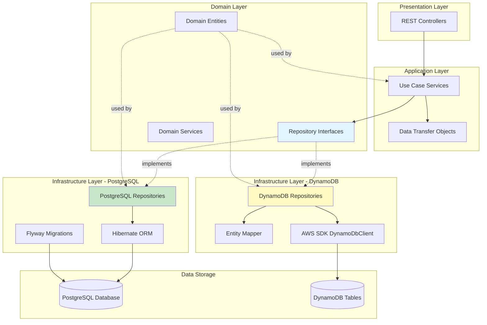

## Repository Pattern Structure

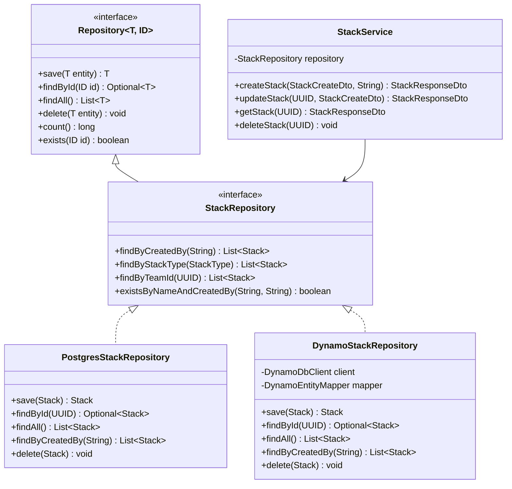

## Database Provider Selection Flow

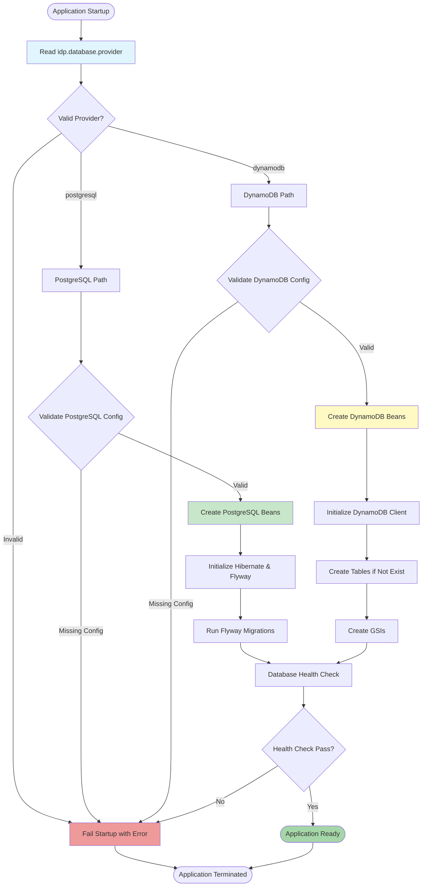

## CDI Bean Injection Flow

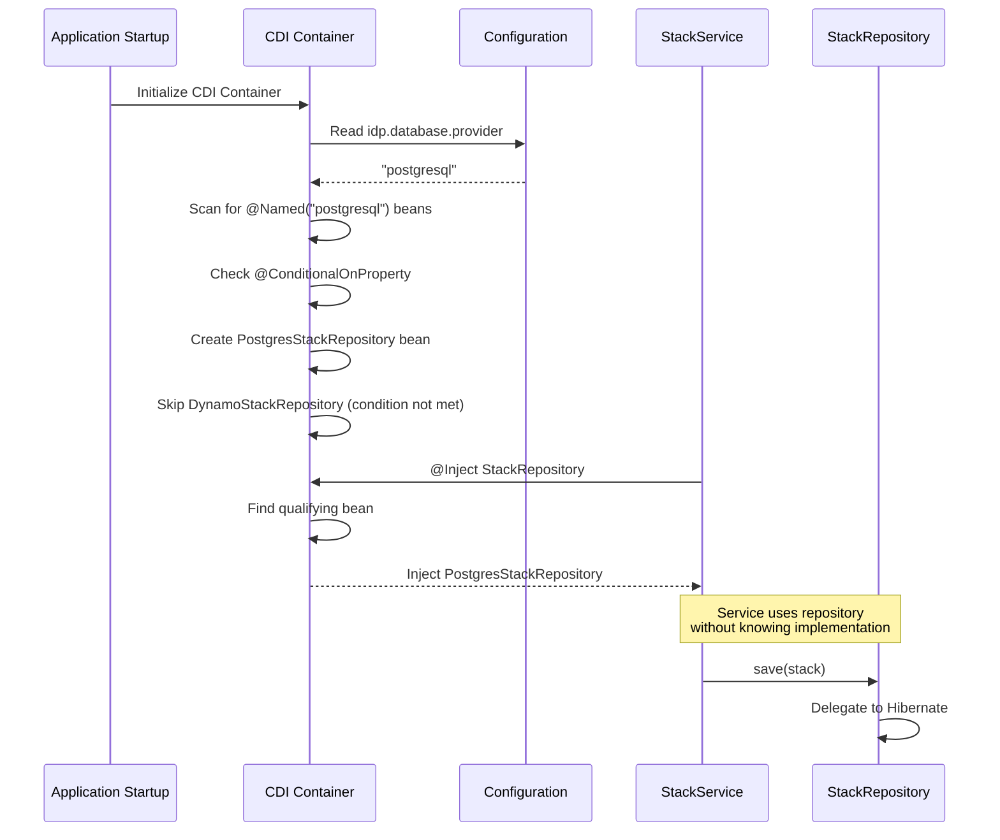

## PostgreSQL Repository Implementation

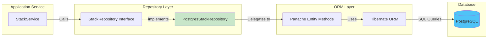

## DynamoDB Repository Implementation

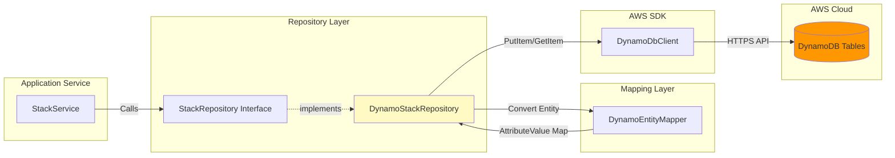

## Entity Mapping Flow (DynamoDB)

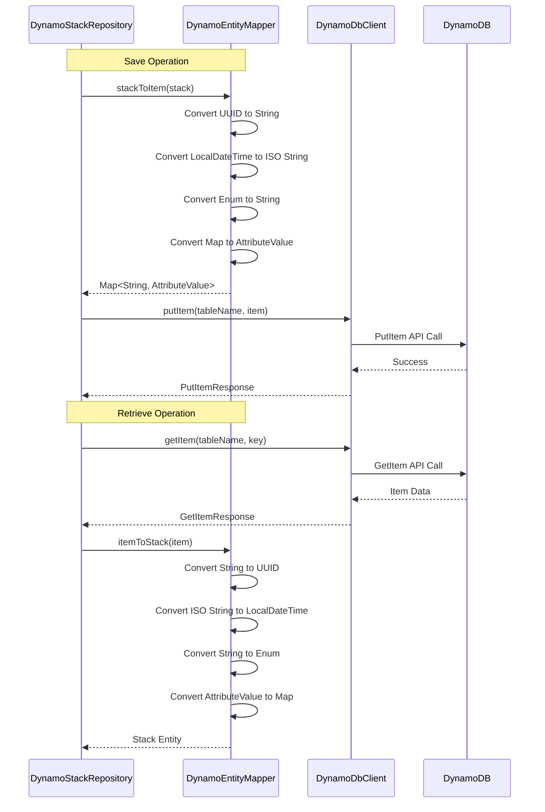

## DynamoDB Table Structure

```mermaid
erDiagram
    IDP_STACKS {
        string id PK
        string name
        string stackType
        string createdBy
        string createdAt
        string description
        string teamId FK
        string blueprintId FK
        map configuration
    }
    
    IDP_TEAMS {
        string id PK
        string name
        string description
        string createdAt
    }
    
    IDP_BLUEPRINTS {
        string id PK
        string name
        string description
        boolean isActive
        string createdAt
    }
    
    IDP_STACKS ||--o{ IDP_TEAMS : "belongs to"
    IDP_STACKS ||--o{ IDP_BLUEPRINTS : "uses"
    
    IDP_STACKS }|--|| GSI_CREATED_BY : "indexed by"
    IDP_STACKS }|--|| GSI_STACK_TYPE : "indexed by"
    IDP_STACKS }|--|| GSI_TEAM_ID : "indexed by"
    
    GSI_CREATED_BY {
        string createdBy PK
        string createdAt SK
    }
    
    GSI_STACK_TYPE {
        string stackType PK
        string createdAt SK
    }
    
    GSI_TEAM_ID {
        string teamId PK
        string createdAt SK
    }
```

## PostgreSQL Schema Structure

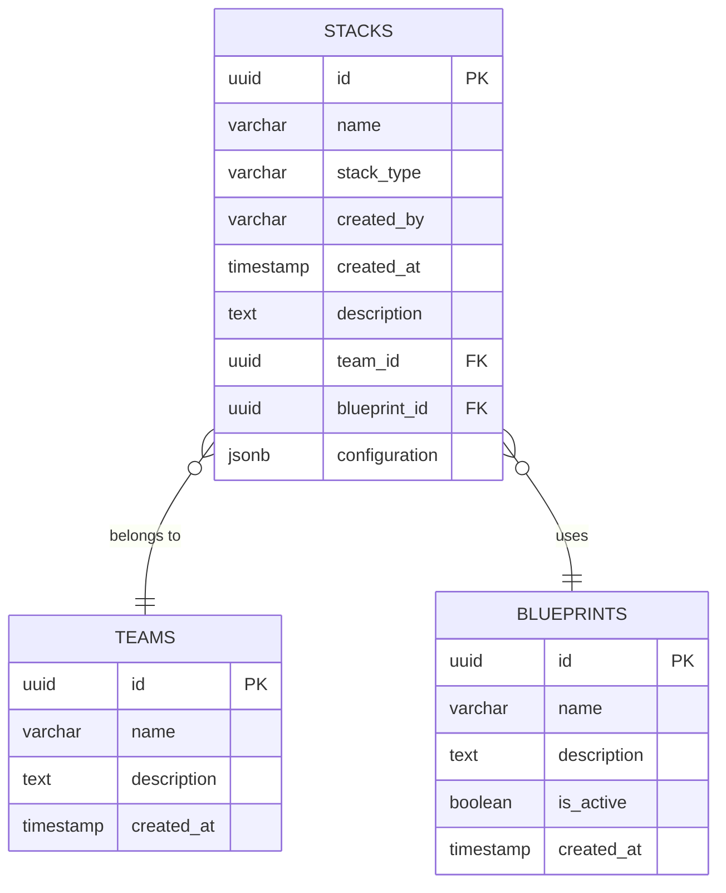

## Transaction Flow Comparison

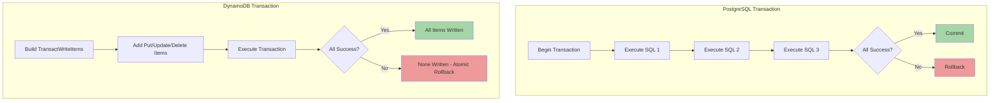

## Query Pattern Optimization

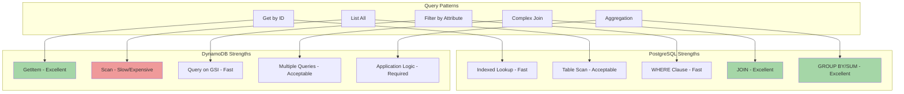

## Deployment Architecture

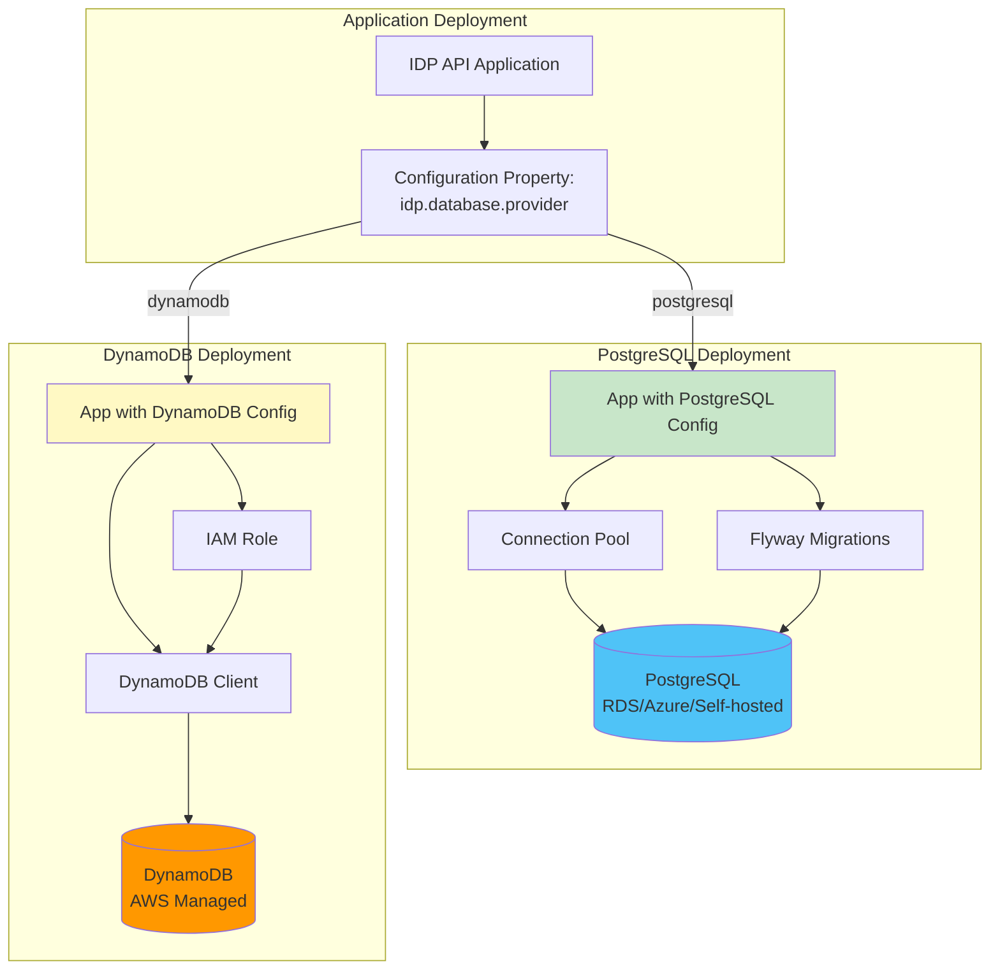

## Health Check Flow

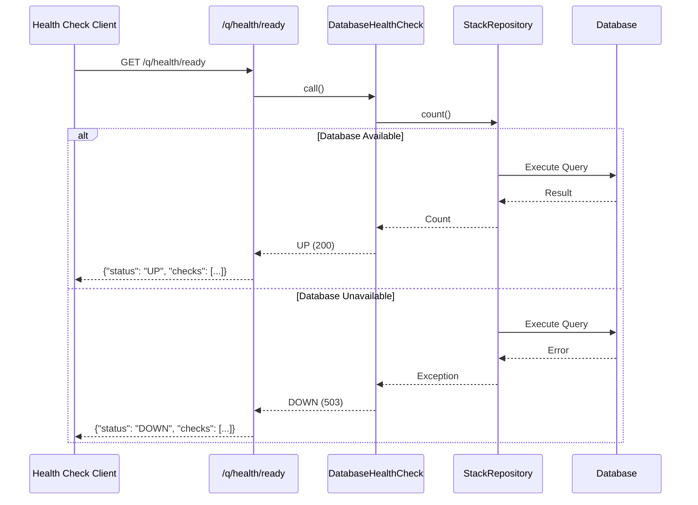

## Testing Strategy

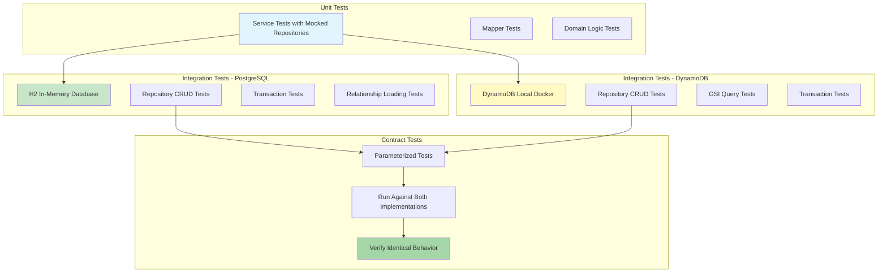

## Configuration Validation Flow

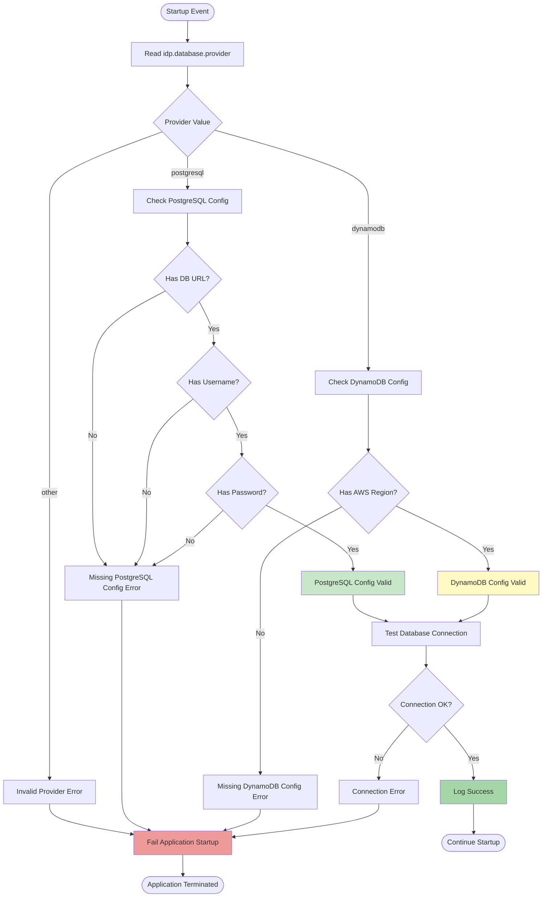

## Data Flow - Create Stack Example

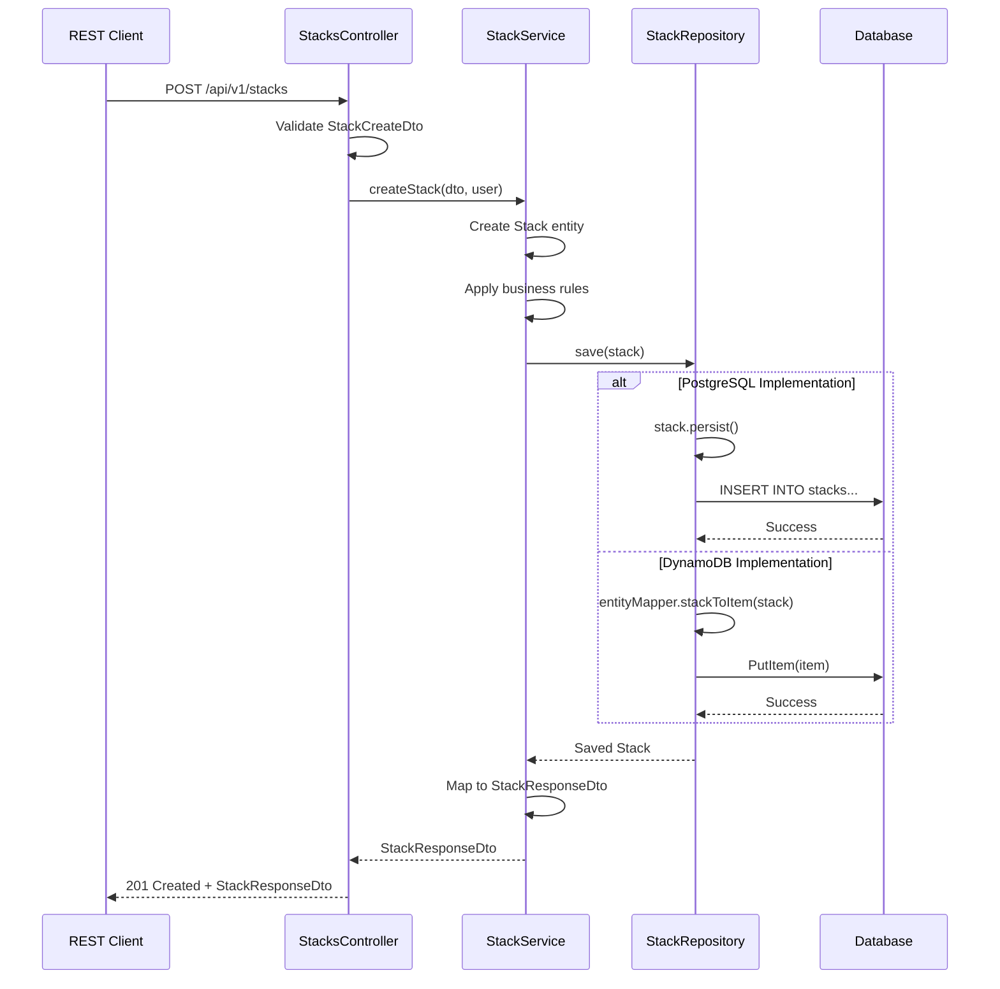

## Legend

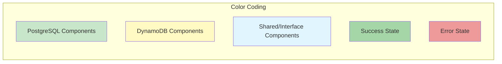
